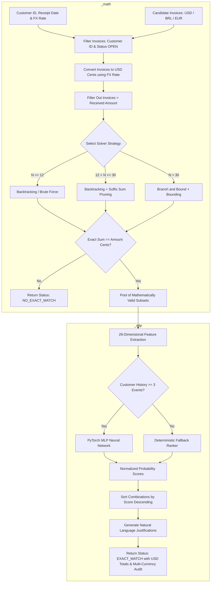

# MLP Saturno: AI Invoice Payment Suggestion Model

<div align="center">

[](https://www.python.org/)
[](https://pytorch.org/)
[](https://scikit-learn.org/)
[](https://jupyter.org/)
[](https://docs.pytest.org/)
[](LICENSE)

**Intelligent accounts receivable reconciliation and exact invoice settlement engine with deterministic mathematical correctness and adaptive ML/Deep Learning ranking.**

**Author**: Elpidio Junior E-ABC  (http://elpidio.pro.br)
**License**: MIT

[Overview](#-overview) •
[Architecture & Dual Engines](#-architecture--the-two-stage-dual-engine-concept) •
[Multi-Currency & USD Settlement](#-multi-currency-support--usd-settlement) •
[Dataset Schemas & Fields](#-dataset-schemas--field-specifications) •
[Mathematical Engine (`_math`)](#-how-to-run-the-mathematical-engine-_math) •
[MLP Ranking Engine (`_mlp`)](#-how-to-run-the-deep-learning-mlp-engine-_mlp) •
[Directory Layout](#-clean-directory-layout) •
[Installation & Quickstart](#-installation--quickstart) •
[Jupyter Notebook](#-jupyter-notebook-20-sections) •
[Documentation](#-technical-documentation)

</div>

---

## 📌 Overview

In enterprise Accounts Receivable (A/R) reconciliation, corporate customers frequently submit lump-sum bank payments to clear multiple open invoices. Determining **which exact combination of open invoices corresponds to the received amount (`amount`)** is a combinatorial optimization challenge with direct impact on cash application speed, credit limits, and accounting integrity.

**MLP Saturno** solves this challenge through a strict, two-stage architectural separation:
1. **Deterministic Mathematical Correctness (`_math/`)**: Exact Subset Sum solvers working strictly with integer arithmetic in **cents (`int`)**. Guarantees that no suggested combination violates accounting equality:
   $$\sum_{i \in \text{Subset}} \text{value}_i = \text{amount}$$
2. **Machine Learning / Deep Learning Ranking (`_mlp/`)**: When multiple mathematically exact combinations exist (e.g., Combination A and Combination B both sum to exactly $10,000.00), a **PyTorch Multi-Layer Perceptron (MLP)** neural network scores each combination based on customer historical payment preferences (e.g., clearing overdue invoices first, clearing highest face values, or clearing oldest invoices) and outputs ranked suggestions with natural language explanations.

---

## 💱 Multi-Currency Support & USD Settlement

The system natively supports multi-currency invoices (e.g., `BRL`, `EUR`, `USD`) and international settlements according to the following strict accounting rules:

1. **Total Always in USD (`currency="USD"`)**:
   - Every reconciliation target, output combination total, and suggested combination is strictly standardized and expressed in **USD**.
2. **Multi-Currency Invoices Converted to USD**:
   - Foreign currency invoices (e.g., `BRL` or `EUR`) are converted to USD at the relevant exchange rate (`exchange_rate` or quotation).
   - Invoices maintain full traceability: each candidate invoice retains its `original_currency`, `original_value`, and applied `exchange_rate` alongside the converted `value` in USD.
3. **Receipt Date & Dollar Quotation Tracking**:
   - The received amount payload returns the **Settlement / Receipt Date** (`receipt_date` / `data_recebimento`) and the **Dollar Quotation** (`exchange_rate` / `cotacao`) applied on that date.

---

## 🏛️ Architecture & The Two-Stage Dual Engine Concept

The system operates as two distinct, decoupled engines that can be executed independently or as an integrated pipeline:



### Summary Comparison: Math Solver vs. MLP Ranker

| Dimension | Stage 1: Mathematical Engine (`_math/`) | Stage 2: Deep Learning Engine (`_mlp/`) |
| :--- | :--- | :--- |
| **Directory** | [`_math/`](./_math/) | [`_mlp/`](./_mlp/) |
| **Primary Goal** | Find **ALL** invoice subsets where $\sum \text{values} == \text{amount}$. | Rank and recommend the **MOST PROBABLE** subset. |
| **Mechanism** | Exact Subset Sum algorithms (Backtracking, Branch & Bound). | 28-feature extraction + PyTorch Neural Network (MLP). |
| **Currency** | Standardized to **USD** integer cents (`int`). | Standardized in **USD** with full original currency audit. |
| **Data Types** | Integer cents (`int`) to avoid floating-point errors. | Normalized float features $[0.0, 1.0]$. |
| **ML Dependencies** | **None** (pure Python standard library). | PyTorch, Scikit-Learn, Pandas. |
| **Execution Mode** | Can run completely standalone (`run_math_solver.py`). | Can extract features, train, and run standalone. |

---

## 📋 Dataset Schemas & Field Specifications

To ensure clear integration with your ERP database, CSV spreadsheets, or JSON files, every dataset format and its required fields are specified below.

### 1. Invoices Dataset (`data/sample/my_invoices.json` / CSV)
Represents candidate open invoices available in the ERP system for settlement.

#### Field Specifications:

| Field Name | Data Type | Required? | Description & Role in Engine | Example |
| :--- | :--- | :---: | :--- | :--- |
| `id` | `int` or `str` | **Yes** | Unique primary key of the invoice in the ERP. Used for tracking and subset output; **strictly excluded** from ML training features. | `1001` |
| `customer_id` | `int` | **Yes** | Identifier of the customer. Used by the data loader to filter out foreign customer invoices before solving. | `41` |
| `value` | `float` | **Yes** | Value in USD (or nominal value in foreign currency converted to USD). Converted to exact integer cents (`int(round(value * 100))`) for Subset Sum. | `2000.00` |
| `currency` | `str` | Optional | Currency code of the invoice (e.g., `"USD"`, `"BRL"`, `"EUR"`). Default is `"USD"`. | `"BRL"` |
| `original_value` | `float` | Optional | Original face value in original currency before conversion. | `10000.00` |
| `original_currency`| `str` | Optional | Original currency code before conversion. | `"BRL"` |
| `exchange_rate` | `float` | Optional | Exchange rate / dollar quotation (e.g. `5.00` BRL per USD) used to convert to USD. | `5.00` |
| `due_date` | `str` (ISO) | **Yes** | Due date (`YYYY-MM-DD`). Used to compute `days_overdue` and overdue delinquency ratios for ML features. | `"2026-01-10"` |
| `issue_date` | `str` (ISO) | **Yes** | Issuance date (`YYYY-MM-DD`). Used to compute invoice age and seniority metrics for ML features. | `"2025-12-01"` |
| `status` | `str` | Optional | Invoice status (e.g., `"OPEN"`, `"PAID"`, `"CANCELLED"`). Only `"OPEN"` invoices participate in reconciliation. | `"OPEN"` |

#### A. JSON Format (`data/sample/my_invoices.json`):
```json
[
  {
    "id": 1001,
    "customer_id": 41,
    "value": 2000.00,
    "due_date": "2026-01-10",
    "issue_date": "2025-12-01",
    "status": "OPEN"
  },
  {
    "id": 1002,
    "customer_id": 41,
    "value": 3500.00,
    "due_date": "2026-01-20",
    "issue_date": "2025-12-10",
    "status": "OPEN"
  },
  {
    "id": 1003,
    "customer_id": 41,
    "value": 4500.00,
    "due_date": "2026-04-10",
    "issue_date": "2026-02-01",
    "status": "OPEN"
  },
  {
    "id": 1004,
    "customer_id": 41,
    "value": 5000.00,
    "due_date": "2026-04-20",
    "issue_date": "2026-02-10",
    "status": "OPEN"
  },
  {
    "id": 1005,
    "customer_id": 41,
    "value": 5000.00,
    "due_date": "2026-04-25",
    "issue_date": "2026-02-15",
    "status": "OPEN"
  },
  {
    "id": 1006,
    "customer_id": 41,
    "value": 1500.00,
    "due_date": "2026-04-30",
    "issue_date": "2026-02-20",
    "status": "OPEN"
  }
]
```

#### B. CSV / Spreadsheet Format (`data/sample/accounts_receivable.csv`):
```csv
id,customer_id,value,due_date,issue_date,status
2001,1025,3200.00,2026-01-15,2025-12-01,OPEN
2002,1025,1800.00,2026-01-20,2025-12-10,OPEN
2003,1025,5000.00,2026-04-10,2026-02-01,OPEN
2004,1025,5430.80,2026-04-15,2026-02-05,OPEN
2005,1025,7000.00,2026-04-20,2026-02-10,OPEN
2006,9999,5000.00,2026-01-01,2025-11-01,OPEN
```

> [!NOTE]
> **Automatic Column Aliases in CSV**: `UniversalDataLoader.load_invoices_from_csv()` automatically recognizes common ERP column names:
> - `invoice_id` $\rightarrow$ `id`
> - `gross_amount` / `invoice_amount` / `amount` $\rightarrow$ `value`
> - `client_id` $\rightarrow$ `customer_id`
> - `dt_vencimento` $\rightarrow$ `due_date`
> - `dt_emissao` $\rightarrow$ `issue_date`

---

### 2. SQL Database Ingestion & View Schema (`vw_training_payment_history`)

When connecting directly to an enterprise relational database (PostgreSQL, MySQL, Oracle, SQL Server, SQLite), the system queries two core entities:
1. `erp_invoices`: All historical and current open invoices.
2. `vw_training_payment_history`: A consolidated view of past settlement events.

#### Complete SQL DDL Script:
```sql
-- Table 1: Invoices Table
CREATE TABLE erp_invoices (
    id BIGINT PRIMARY KEY,
    customer_id BIGINT NOT NULL,
    invoice_number VARCHAR(64) NOT NULL,
    issue_date DATE NOT NULL,
    due_date DATE NOT NULL,
    gross_amount DECIMAL(15, 2) NOT NULL,
    status VARCHAR(20) NOT NULL DEFAULT 'OPEN'
);

-- Table 2: Payment Settlement Events Header
CREATE TABLE erp_payment_events (
    payment_id BIGINT PRIMARY KEY,
    customer_id BIGINT NOT NULL,
    payment_date DATE NOT NULL,
    amount_received DECIMAL(15, 2) NOT NULL
);

-- Table 3: Payment Settlement Items (Cleared Invoices)
CREATE TABLE erp_payment_items (
    payment_id BIGINT REFERENCES erp_payment_events(payment_id),
    invoice_id BIGINT REFERENCES erp_invoices(id),
    cleared_amount DECIMAL(15, 2) NOT NULL,
    PRIMARY KEY (payment_id, invoice_id)
);

-- View: Historical Training View (vw_training_payment_history)
CREATE OR REPLACE VIEW vw_training_payment_history AS
SELECT 
    p.payment_id,
    p.customer_id,
    p.amount_received AS amount,
    p.payment_date,
    ARRAY_AGG(pi.invoice_id) AS selected_invoice_ids
FROM erp_payment_events p
JOIN erp_payment_items pi ON p.payment_id = pi.payment_id
GROUP BY p.payment_id, p.customer_id, p.amount_received, p.payment_date;
```

#### Field Specifications of `vw_training_payment_history`:

| Column Name | Data Type | Required? | Description | Example |
| :--- | :--- | :---: | :--- | :--- |
| `payment_id` | `BIGINT` | **Yes** | Unique identifier of the past settlement event. | `501` |
| `customer_id` | `BIGINT` | **Yes** | Identifier of the customer who made the payment. | `41` |
| `amount` | `DECIMAL(15,2)` | **Yes** | Total monetary amount received in that settlement. | `10000.00` |
| `payment_date` | `DATE` / `VARCHAR` | **Yes** | Date when the payment occurred (`YYYY-MM-DD`). | `'2026-02-15'` |
| `selected_invoice_ids`| `ARRAY` / `VARCHAR`| **Yes** | Array or comma-separated list of invoice IDs that were settled. | `ARRAY[1004, 1005]` or `"{1004,1005}"` |

---

### 3. Historical Settlements Dataset in JSON (`data/payment_history.json`)

Used to store historical settlement records for offline feature extraction and training.

```json
[
  {
    "payment_id": 1,
    "customer_id": 41,
    "amount": 10000.00,
    "amount_cents": 1000000,
    "payment_date": "2026-02-15",
    "available_invoices": [
      {
        "id": 1001,
        "customer_id": 41,
        "value": 2000.00,
        "due_date": "2026-01-10",
        "issue_date": "2025-12-01",
        "status": "OPEN"
      },
      {
        "id": 1004,
        "customer_id": 41,
        "value": 5000.00,
        "due_date": "2026-04-20",
        "issue_date": "2026-02-10",
        "status": "OPEN"
      },
      {
        "id": 1005,
        "customer_id": 41,
        "value": 5000.00,
        "due_date": "2026-04-25",
        "issue_date": "2026-02-15",
        "status": "OPEN"
      }
    ],
    "selected_invoice_ids": [1004, 1005]
  }
]
```

---

### 4. Extracted Feature Matrix (`data/training_features_dataset.csv`)

When `FeatureExtractor.create_training_dataset()` is executed, it computes a 28-dimensional numerical feature vector for each candidate combination:

| # | Feature Column Name | Type | Description |
| :---: | :--- | :---: | :--- |
| 1 | `comb_total_value` | `float` | Sum of nominal values in the combination. |
| 2 | `comb_number_of_invoices` | `int` | Cardinality $|S|$ of the invoice subset. |
| 3 | `comb_avg_invoice_value` | `float` | Mean face value of invoices in the subset. |
| 4 | `comb_min_invoice_value` | `float` | Smallest face value in the subset. |
| 5 | `comb_max_invoice_value` | `float` | Largest face value in the subset. |
| 6 | `comb_value_spread` | `float` | Difference ($\max - \min$) between values in the subset. |
| 7 | `comb_max_invoice_ratio` | `float` | Ratio of the largest invoice relative to total received amount ($\frac{\max(v)}{\text{amount}}$). |
| 8 | `comb_min_invoice_ratio` | `float` | Ratio of the smallest invoice relative to total received amount ($\frac{\min(v)}{\text{amount}}$). |
| 9 | `comb_avg_invoice_ratio` | `float` | Average ratio of invoices relative to total amount. |
| 10 | `comb_value_std` | `float` | Standard deviation of values within the combination. |
| 11 | `comb_overdue_count` | `int` | Number of invoices in the combination past their due date. |
| 12 | `comb_overdue_ratio` | `float` | Proportion of invoices in the combination that are overdue ($\frac{\text{overdue count}}{|S|}$). |
| 13 | `comb_avg_days_overdue` | `float` | Mean delinquency in days past due date for overdue items. |
| 14 | `comb_max_days_overdue` | `float` | Maximum days past due date among items in the combination. |
| 15 | `comb_oldest_age` | `int` | Days elapsed since issuance of the oldest invoice in the combination. |
| 16 | `comb_newest_age` | `int` | Days elapsed since issuance of the most recent invoice. |
| 17 | `comb_age_spread` | `int` | Age spread ($\text{oldest} - \text{newest}$) in days. |
| 18 | `comb_avg_age` | `float` | Average age of all invoices in the combination. |
| 19 | `cust_num_payments` | `int` | Total historical settlement events recorded for this customer. |
| 20 | `cust_avg_payment_amount` | `float` | Customer's historical average payment amount. |
| 21 | `cust_avg_invoices_per_payment` | `float` | Customer's historical average invoice count cleared per payment. |
| 22 | `cust_avg_days_overdue_hist` | `float` | Customer's historical average days overdue when clearing invoices. |
| 23 | `cust_pattern_overdue_pref` | `float` | Overdue priority preference index $[0.0, 1.0]$. |
| 24 | `cust_pattern_highest_val_pref` | `float` | Highest face value priority preference index $[0.0, 1.0]$. |
| 25 | `cust_pattern_oldest_pref` | `float` | Oldest invoice priority preference index $[0.0, 1.0]$. |
| 26 | `interact_overdue_alignment` | `float` | Cross-interaction: `comb_overdue_ratio` $\times$ `cust_pattern_overdue_pref`. |
| 27 | `interact_value_alignment` | `float` | Cross-interaction: `comb_max_invoice_ratio` $\times$ `cust_pattern_highest_val_pref`. |
| 28 | `interact_age_alignment` | `float` | Cross-interaction: `comb_avg_age` $\times$ `cust_pattern_oldest_pref`. |
| — | `target_is_selected` | `int` | **Target Label**: `1` for the ground truth chosen combination, `0` for alternatives. |

---

## 🔢 How to Run the Mathematical Engine (`_math/`)

The mathematical engine solves the Subset Sum problem with 100% exact integer arithmetic. It has **no machine learning dependencies**.

### Option A: Run via CLI Script
```bash
python3 _math/run_math_solver.py
```

**What it does:**
1. Loads candidate invoices from `data/sample/my_invoices.json`.
2. Filters out foreign customers and invoices with value $> \text{amount}$.
3. Converts values to integer cents.
4. Executes the deterministic `BacktrackingSolver` with suffix-sum pruning.
5. Prints every exact mathematical match found.

**Sample CLI Output:**
```text
================================================================================
🔢 PURE MATHEMATICAL ENGINE - EXACT SUBSET SUM SOLVER
================================================================================
Customer ID: 41
Received Amount: $10,000.00 (1000000 cents)
Loaded Candidate Invoices: 6 items

Executing Deterministic Solver: BacktrackingSolver
================================================================================
Result: Status = EXACT_MATCH | Combinations Found: 4

✓ Combination #1: IDs [1004, 1005] | Values: [5000.0, 5000.0] | Sum: $10,000.00 | Remaining: $0.00
✓ Combination #2: IDs [1004, 1002, 1006] | Values: [5000.0, 3500.0, 1500.0] | Sum: $10,000.00 | Remaining: $0.00
✓ Combination #3: IDs [1005, 1002, 1006] | Values: [5000.0, 3500.0, 1500.0] | Sum: $10,000.00 | Remaining: $0.00
✓ Combination #4: IDs [1003, 1002, 1001] | Values: [4500.0, 3500.0, 2000.0] | Sum: $10,000.00 | Remaining: $0.00
================================================================================
```

### Option B: Run Algorithmic Benchmark
```bash
python3 _math/benchmark_solvers.py
```
Compares latency (ms) across **Brute Force**, **Backtracking**, **Dynamic Programming**, and **Branch & Bound** across $N = 5, 10, 20, 50, 100$ invoices.

### Option C: Use Directly in Python
```python
from src.solvers.solver_factory import SolverFactory
from src.data.schemas import Invoice, to_cents

invoices = [
    Invoice(id=101, customer_id=41, value=4000.00, due_date="2026-03-01", issue_date="2026-01-01"),
    Invoice(id=102, customer_id=41, value=6000.00, due_date="2026-03-10", issue_date="2026-01-05"),
]
amount_cents = to_cents(10000.00)

solver = SolverFactory.get_solver(invoices=invoices)
subsets = solver.find_combinations(invoices=invoices, target_cents=amount_cents)

for s in subsets:
    print(f"Matched Invoice IDs: {[inv.id for inv in s]}")
```

---

## 🧠 How to Run the Deep Learning MLP Engine (`_mlp/`)

The MLP engine scores and ranks the mathematically valid combinations based on learned customer habits.

### Step 1: Extract the 28-Feature Dataset
```bash
python3 _mlp/generate_features.py
```
Reads `data/payment_history.json`, calculates 28 numerical features for each candidate subset, and exports `data/training_features_dataset.csv`.

### Step 2: Train the PyTorch MLP Neural Network
```bash
python3 _mlp/train_mlp.py
```
Trains the neural network using binary cross-entropy, evaluates Top-1 and Top-3 accuracy on the validation set, and persists model weights into `saved_models/pytorch_mlp_weights.pt` and `saved_models/pytorch_scaler.joblib`.

### Step 3: Run Full Two-Stage Inference (Math + MLP Ranking)
```bash
python3 _mlp/run_inference.py
```

**Sample Integrated Output:**
```text
================================================================================
🎯 INTEGRATED INFERENCE ENGINE (MATH SOLVER + MLP RANKING)
================================================================================
Customer ID: 41
Received Amount: $10,000.00
Input Open Invoices: 6 items

Running Two-Stage Pipeline...
Status: EXACT_MATCH | Total Mathematical Subsets: 4

🏆 [Rank #1] Probability Score: 0.9500
   Invoices: [1004, 1005] | Face Values: [5000.0, 5000.0]
   Sum: $10,000.00 | Remainder: $0.00 | Count: 2 invoices
   Explanations:
     • The combination matches the exact received amount with zero remaining balance (exact match).
     • Customer historically prioritizes highest value invoices (largest in set: $5,000.00).
     • Efficient reconciliation using concise subset (2 invoices).

🏆 [Rank #2] Probability Score: 0.5765
   Invoices: [1004, 1002, 1006] | Face Values: [5000.0, 3500.0, 1500.0]
   Sum: $10,000.00 | Remainder: $0.00 | Count: 3 invoices
   Explanations:
     • Contains 1 overdue invoice(s) with an average delay of 13 days.
     • Customer payment history indicates strong preference for clearing overdue invoices first.
================================================================================
```

---

## 📁 Clean Directory Layout

All project scripts are neatly organized into dedicated directories:

```text
mlp-saturno/
├── README.md                                  # Comprehensive documentation & guides
├── LICENSE                                    # MIT License (Elpidio Junior E-ABC)
├── requirements.txt                           # Pinned dependencies (torch, sklearn, pandas, etc.)
│
├── _math/                                     # DETERMINISTIC MATHEMATICAL SOLVER TOOLS
│   ├── run_math_solver.py                     # Standalone math solver runner (no ML)
│   └── benchmark_solvers.py                   # Latency benchmark across 4 algorithms
│
├── _mlp/                                      # DEEP LEARNING & FEATURE ENGINEERING TOOLS
│   ├── generate_features.py                   # 28-feature extraction script
│   ├── train_mlp.py                           # PyTorch MLP training & validation script
│   └── run_inference.py                       # Full two-stage inference script
│
├── data/                                      # Datasets & ERP schemas
│   ├── sample/
│   │   ├── my_invoices.json                   # Sample open invoices (JSON)
│   │   └── accounts_receivable.csv            # Sample open invoices (CSV)
│   ├── payment_history.json                   # Historical payment settlements
│   └── training_features_dataset.csv          # Extracted 28-feature tabular matrix
│
├── saved_models/                              # Persisted trained weights & scalers
│   ├── pytorch_mlp_weights.pt
│   ├── pytorch_scaler.joblib
│   └── baseline_models.joblib
│
├── src/                                       # Core modular library
│   ├── data/
│   │   ├── schemas.py                         # Data structures & to_cents() conversion
│   │   ├── loaders.py                         # JSON, CSV, and SQL UniversalDataLoader
│   │   └── synthetic.py                       # Multi-profile synthetic generator
│   ├── solvers/
│   │   ├── base.py                            # BaseSolver abstract class
│   │   ├── brute_force.py                     # Brute Force solver
│   │   ├── backtracking.py                    # Backtracking with suffix sum pruning
│   │   ├── dynamic_programming.py             # 0/1 Knapsack DP solver
│   │   ├── branch_and_bound.py                # Branch & Bound for large N
│   │   └── solver_factory.py                  # Automatic solver selection
│   ├── features/
│   │   └── engineering.py                     # 28-dimension numerical FeatureExtractor
│   ├── models/
│   │   ├── neural_mlp.py                      # PyTorch MLP Neural Network
│   │   ├── baselines.py                       # Random Forest & Gradient Boosting
│   │   └── fallback.py                        # Deterministic rule-based ranker
│   ├── explainability/
│   │   └── explainer.py                       # Natural language justification generator
│   └── pipeline/
│       └── inference.py                       # suggest_invoice_payments() pipeline
│
├── notebooks/
│   └── ai_invoice_payment_suggestion.ipynb    # Fully executed 20-section Jupyter Notebook
├── tests/
│   └── test_scenarios.py                      # Automated pytest test suite (11 scenarios)
└── scripts/
    └── build_notebook.py                      # Notebook compilation script
```

---

## 🚀 Installation & Quickstart

### 1. Create and Activate Virtual Environment
```bash
python3 -m venv .venv
source .venv/bin/activate

pip install --upgrade pip
pip install -r requirements.txt
```

### 2. Run Automated Pytest Test Suite
```bash
pytest tests/test_scenarios.py -v
```

### 3. Launch Jupyter Notebook
```bash
jupyter notebook notebooks/ai_invoice_payment_suggestion.ipynb
```

---

## 📓 Jupyter Notebook (20 Sections)

The notebook [`./notebooks/ai_invoice_payment_suggestion.ipynb`](./notebooks/ai_invoice_payment_suggestion.ipynb) contains complete code, visualizations, and interpretations across all 20 sections:

1. **`01 - Problem Definition`**: Accounting reconciliation problem and mathematical/probabilistic separation.
2. **`02 - Imports`**: Scientific packages, PyTorch, and internal modules.
3. **`03 - Synthetic Dataset Generation`**: Multi-profile customer history generator.
4. **`04 - Exploratory Data Analysis`**: Distribution plots of payments and subsets.
5. **`05 - Data Preparation`**: Settlement event inspection.
6. **`06 - Monetary Data Normalization`**: Strict conversion to integer cents.
7. **`07 - Combination Algorithms`**: Testing the 4 Subset Sum solvers.
8. **`08 - Performance Comparison`**: Latency scaling charts ($N = 5, 10, 20, 50, 100$).
9. **`09 - Generate Candidate Combinations`**: Exact subset generation.
10. **`10 - Feature Engineering`**: 28-dimensional numerical feature extraction.
11. **`11 - Baseline Machine Learning`**: Logistic Regression, Random Forest, Gradient Boosting.
12. **`12 - Deep Learning Model`**: PyTorch MLP neural network architecture.
13. **`13 - Model Training`**: Loss curve convergence.
14. **`14 - Model Evaluation`**: Top-1 and Top-3 accuracy benchmarks.
15. **`15 - Invoice Payment Inference`**: End-to-end inference execution.
16. **`16 - Ranking Valid Combinations`**: Ranked suggestions with natural language explanations.
17. **`17 - Test Scenarios`**: Interactive execution of all 11 test cases.
18. **`18 - Performance Analysis`**: Latency benchmarks (< 30ms).
19. **`19 - Final Recommendation`**: Production deployment architecture.
20. **`20 - Conclusion`**: Synthesis of results and findings.

---

## 🧪 Automated Testing Matrix (13 Scenarios)

| # | Verified Scenario | Input Condition | Expected Output | Status |
| :---: | :--- | :--- | :--- | :---: |
| 01 | **Single exact match** | 3 invoices, 1 valid subset | Returns single exact combination | ✅ Passed |
| 02 | **Multiple exact matches** | 6 invoices, multiple subsets | Returns all valid ranked combinations | ✅ Passed |
| 03 | **No exact match** | Invoice sum != amount | Returns `NO_EXACT_MATCH` | ✅ Passed |
| 04 | **Other customer invoices** | Foreign customer invoice mixed | Foreign invoice discarded | ✅ Passed |
| 05 | **Invoices > Amount** | Value exceeds received sum | Pruned immediately | ✅ Passed |
| 06 | **Identical face values** | Same amount on distinct IDs | Distinct combinations indexed by ID | ✅ Passed |
| 07 | **Amount = Single invoice** | Single invoice equals amount | Returns 1-invoice subset | ✅ Passed |
| 08 | **Amount > Total debt** | Amount exceeds balance | Returns `NO_EXACT_MATCH` | ✅ Passed |
| 09 | **Hundreds of invoices** | Batch of 200 open invoices | Solver runs in sub-second | ✅ Passed |
| 10 | **Customer with history** | Overdue preference history | PyTorch MLP ranks overdue subset #1 | ✅ Passed |
| 11 | **Cold Start (No history)** | New customer | Deterministic fallback activated | ✅ Passed |
| 12 | **Multi-Currency (BRL -> USD)** | BRL invoices with receipt date & dollar quotation | Converted to USD, returns receipt date & FX rate | ✅ Passed |
| 13 | **Mixed Currencies (USD, BRL, EUR)** | Invoices in distinct currencies | Converted to USD target with detailed audit | ✅ Passed |

---

## 📖 Technical Documentation

- [01 - System Architecture & Design Decisions](./docs/01-architecture.md)
- [02 - Combination Algorithms & Subset Sum Theory](./docs/02-combination-algorithms.md)
- [03 - Feature Engineering & PyTorch Neural Network](./docs/03-feature-engineering-ml.md)
- [04 - Guide for Integration with Real ERP Data](./docs/04-real-data-guide.md)
- [05 - Test Scenarios Specification Matrix](./docs/05-test-scenarios.md)

---

## 📄 License

This project is licensed under the MIT License - see the [LICENSE](LICENSE) file for details.  
Copyright (c) 2026 Elpidio Junior E-ABC.
