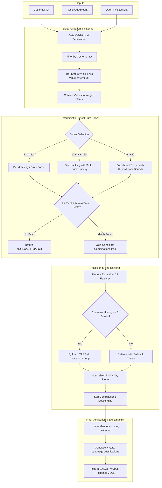

# System Architecture - AI Invoice Payment Suggestion Model

**Author**: Elpidio Junior E-ABC  
**License**: MIT

---

## 1. Overview

The **AI Invoice Payment Suggestion Model** is designed to solve the automated accounts receivable reconciliation problem between a received payment (`amount`) and a list of open candidate invoices (`invoices`) for a given customer (`customer_id`).

The architecture adopts a strict **separation of concerns**:
- **Deterministic Accounting Layer**: Exact Subset Sum resolution using integer arithmetic in **cents**.
- **Intelligent Ranking Layer (ML & Deep Learning)**: Statistical models and a **PyTorch MLP** neural network trained on historical payment events to score and rank candidate combinations according to each customer's specific preference profile.
- **Independent Accounting Validation**: Every suggested combination undergoes independent integrity verification before presentation.

---

## 2. Decision and Data Flow Diagram



---

## 3. Core Separation Principle

> [!IMPORTANT]
> **Never use Deep Learning or probabilistic heuristics to validate financial sums.**
> Neural networks can hallucinate or output fractional rounding discrepancies. The mathematical validation is 100% deterministic. Machine Learning operates exclusively to rank the relative relevance among combinations that are **already mathematically exact**.

$$\text{Accounting Decision} = \text{Deterministic Solver (Correctness)} \oplus \text{Machine Learning (Relevance / Ranking)}$$

---

## 4. Strict Monetary Normalization

Floating-point numbers (`float`) are inherently inaccurate for accounting systems due to binary representation (IEEE 754):

```python
# Inadequate:
3333.33 + 6666.72 == 10000.05  # May evaluate to False due to 10000.049999999999

# Standard Adopted in this System:
to_cents(3333.33) + to_cents(6666.72) == to_cents(10000.05)  # 333333 + 666672 == 1000005 (True)
```

All internal calculations, hash sets, equality checks, and dynamic programming matrices use integer cents. Values are converted back to currency format with 2 decimals only during JSON response serialization.

---

## 5. Cold Start Strategy

For new customers or customers with fewer than 3 recorded historical payments (`min_history_events < 3`):
1. Probabilistic inference is skipped to prevent noisy decisions;
2. The **Deterministic Fallback Ranker** is activated applying standard business accounting logic:
   - **Priority 1**: Higher overdue ratio and total overdue days;
   - **Priority 2**: Oldest issue date (invoice age);
   - **Priority 3**: Higher individual invoice face value;
   - **Priority 4**: Fewer invoices to clear amount (conciseness).
